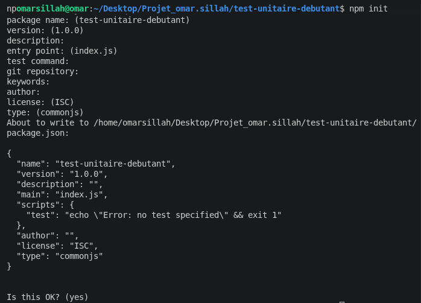
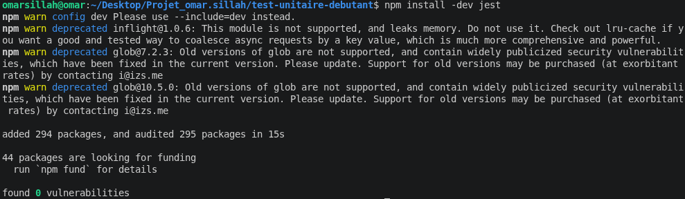
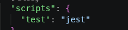
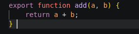
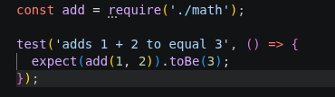
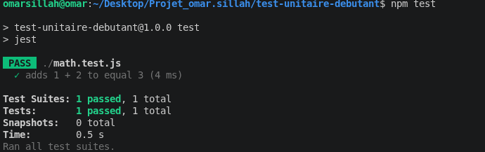
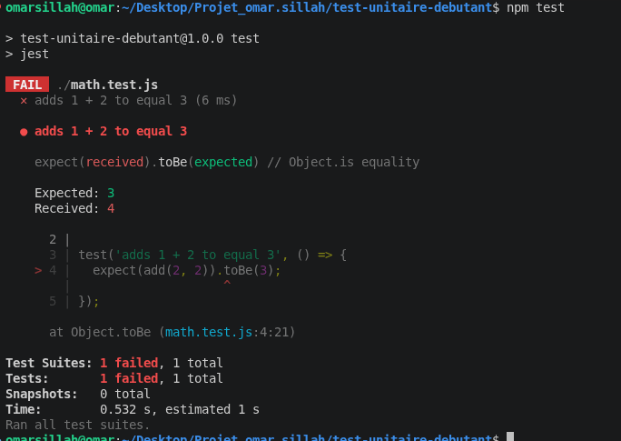
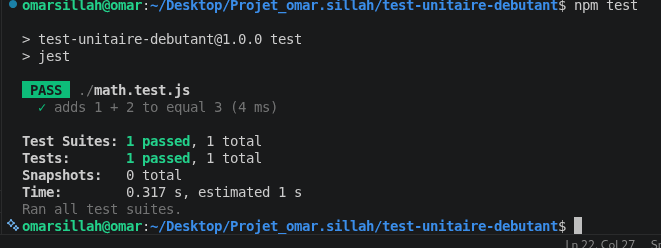

<!-- Initialisation du projet Node -->

<!-- Installation de Jest -->

<!-- Configuration de Jest dans le package.json -->

<!-- Fonction addition -->

<!-- test synthaxe test et expect -->

<!-- écrire et lancer le test unitaire -->

<!-- modifiation du code pour avoir une erreur quand le code est lancé -->

<!-- repassage du test -->
