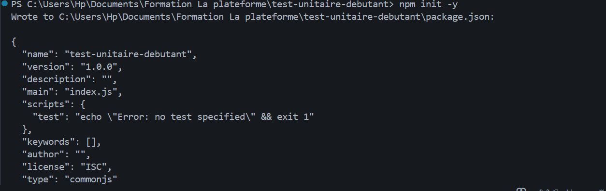
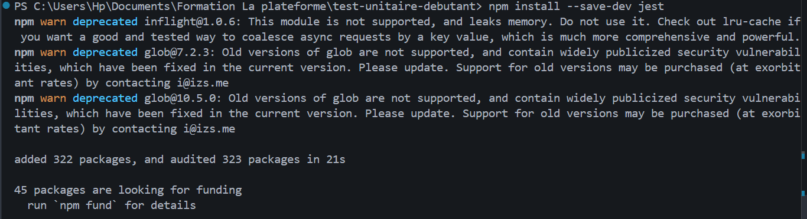
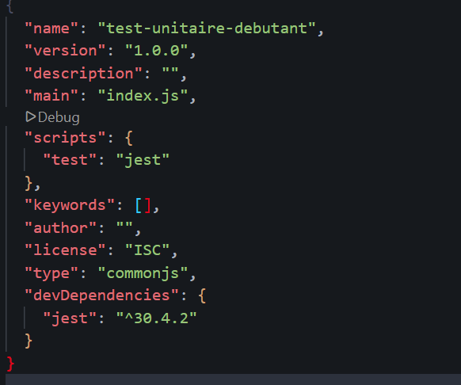
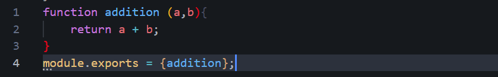
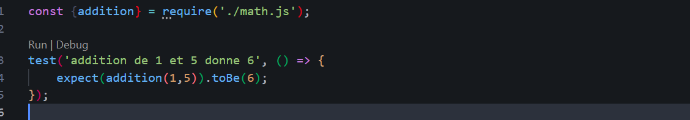
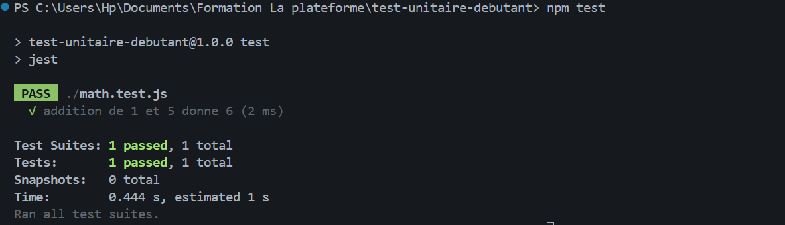

1.Création d'un nouveau projet Node.js à l'aide de la commande :
npm init -y
Cette commande génère automatiquement le fichier package.json contenant la configuration du projet.

2.Installation du framework de tests Jest en dépendance de développement :
npm install --save-dev jest

3.Modification du fichier package.json afin d'ajouter le script permettant d'exécuter les tests :

"scripts": {
  "test": "jest"
}

4.Création du fichier Math.js contenant une fonction d'addition :

function addition(a, b) {
    return a + b;
}
module.exports = addition;

5.Création du fichier Math.test.js permettant de vérifier le bon fonctionnement de la fonction :

const addition = require('./Math');
test('Addition de 1 + 5 doit retourner 6', () => {
    expect(addition(1, 5)).toBe(6);
});

6.Lancement des tests avec la commande :
npm test
Le test est exécuté avec succès et retourne le résultat attendu.

7.Modification volontaire de la fonction afin de provoquer un échec du test et vérifier le comportement de Jest lors de la détection d'une anomalie.

8.Restauration du code correct puis relance des tests.
Les tests repassent au vert, confirmant que la fonction fonctionne de nouveau conformément aux attentes.
