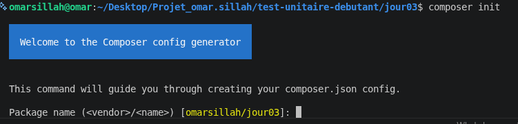
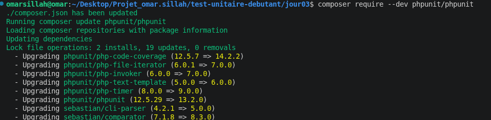
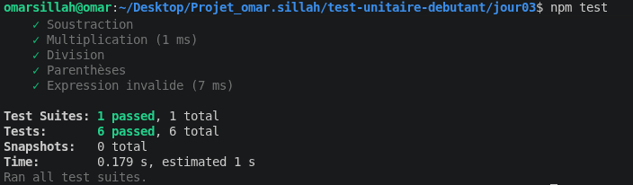
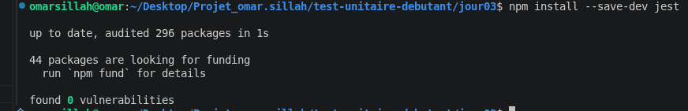
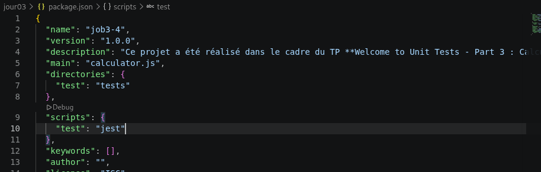
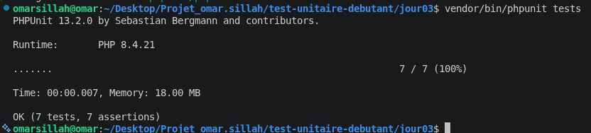
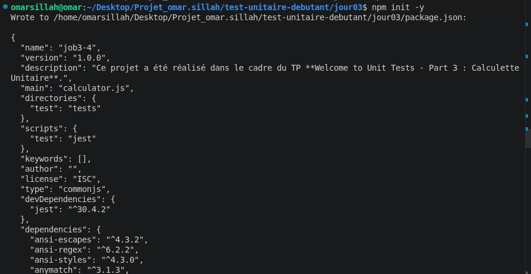
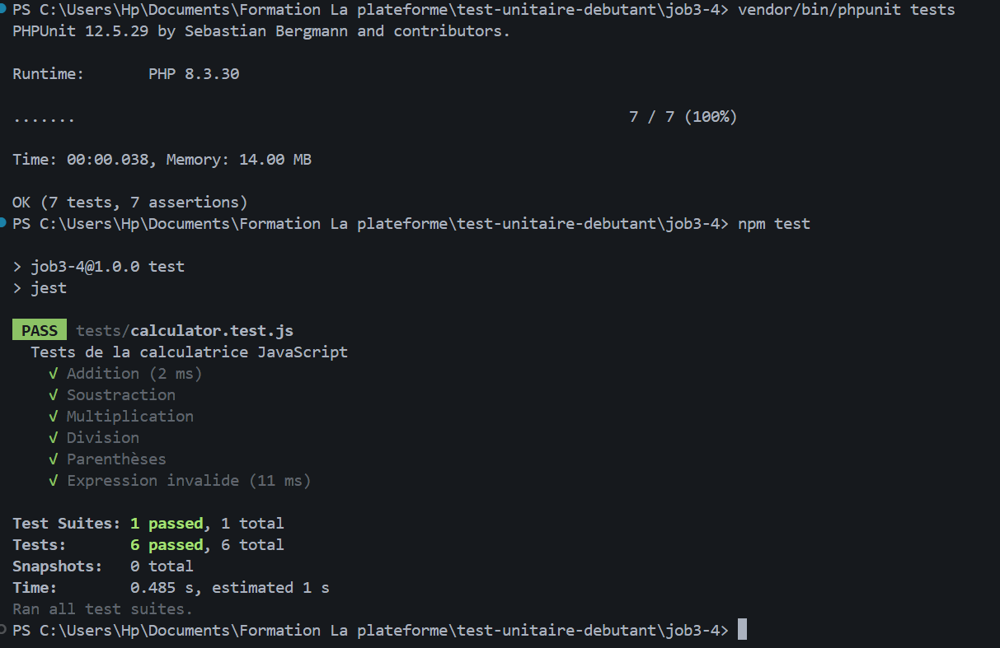

# Test Unitaire Débutant

## Présentation

Ce projet a été réalisé dans le cadre du TP **Welcome to Unit Tests - Part 3 : Calculette Unitaire**.

L'objectif est de mettre en place des tests unitaires sur une calculatrice développée en PHP et en JavaScript afin de vérifier le bon fonctionnement des opérations mathématiques et la gestion des erreurs.

## Technologies utilisées

* PHP
* PHPUnit
* JavaScript
* Jest
* HTML / CSS
* Git / GitHub

---

# Structure du projet

```text
test-unitaire-debutant/
│
├── calculator.php
├── calculator.js
├── Calculator_PHP.php
├── Calculator_JS.html
├── calculator.css
│
├── tests/
│   ├── CalculatorTest.php
│   └── calculator.test.js
│
├── images/
│
├── composer.json
├── package.json

└── README.md
```

---

# Installation du projet

## Installation de PHPUnit

Création du projet Composer :

```bash
composer init
```

Installation de PHPUnit :

```bash
composer require --dev phpunit/phpunit
```

### Capture d'écran




Cette étape permet d'installer PHPUnit afin d'exécuter les tests unitaires PHP.

---

## Installation de Jest

Initialisation du projet Node.js :

```bash
npm init -y
```

Installation de Jest :

```bash
npm install --save-dev jest
```

Modification du fichier package.json :

```json
"scripts": {
  "test": "jest"
}
```

### Capture d'écran






Cette étape permet d'installer Jest afin d'exécuter les tests unitaires JavaScript.

---

# Tests unitaires PHP

Le fichier de test se trouve dans :

```
tests/CalculatorTest.php
```

Tests réalisés :

* Addition
* Soustraction
* Multiplication
* Division
* Division par zéro

### Exécution

```bash
vendor/bin/phpunit tests
```

### Capture d'écran



# Tests unitaires JavaScript

Le fichier de test se trouve dans :

```
tests/calculator.test.js
```

Tests réalisés :

* Addition
* Soustraction
* Multiplication
* Division
* Priorité des opérations
* Parenthèses
* Expression invalide

### Exécution

```bash
npm test
```

### Capture d'écran



---

# Validation finale

Exécution des tests PHP :

```bash
vendor/bin/phpunit tests
```

Exécution des tests JavaScript :

```bash
npm test
```

### Capture d'écran



Tous les tests sont validés avec succès.

---

